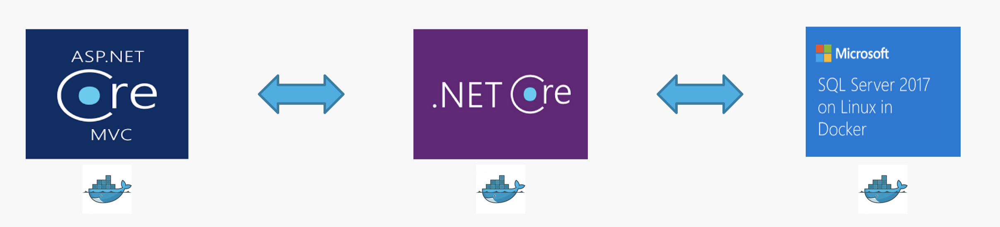

# ABC2018
This Repository contains the complete source code of the demo used for Global Azure Boot Camp 2018 at Singapore. The event was held on 21 April 2018.

The end goal of the demo is to build an application for managing tech talks. There are multiple components which are added progressively to scale the application. All the components are deployed to Kubernetes cluster using Docker containers.

Initially it starts with a web front end named TechTalksWeb. This interfaces with a backend API named TechTalksAPI. The persistence part is handled using TechTalksDB. 

